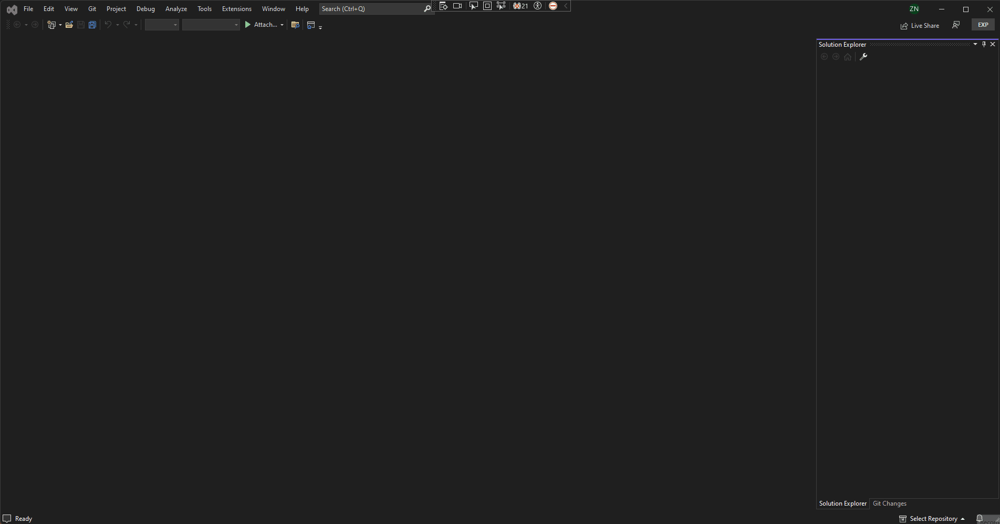

# vs-extension

## What is Windows Perf GUI

Windows Perf GUI is a Visual Studio extension that aims to provide a GUI for [Windows Perf](https://gitlab.com/Linaro/WindowsPerf/windowsperf)

## How to use Windows Perf

### Setting up the wperf path

In order to set the path to the wperf executable, go to `Tools -> Options -> Windows Perf -> Wperf Path` and set the **absolute** path to the `wperf.exe` executable and then click save.



## What can you do with Visual Studio extension for Windows Perf GUI

Under construction...

## Project Structure

```bash
└───Windows Perf GUI
    ├───Commands    (Commands for the extension)
    ├───Properties  (Contains the AssemblyInfo.cs file that describes the application metadata)
    ├───Resources   (Contains the icons for the extension)
    └───ToolWindows (Contains the code for the tool window)
```

## Authors and acknowledgment

Show your appreciation to those who have contributed to the project.

## License

All code in this repository is licensed under the [BSD 3-Clause License](LICENSE)
